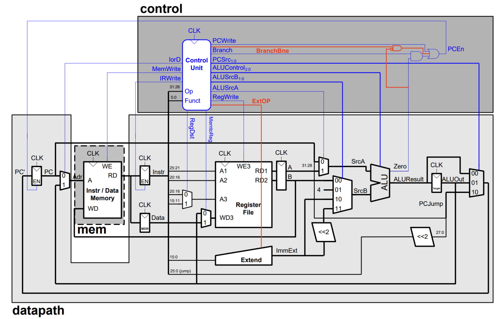
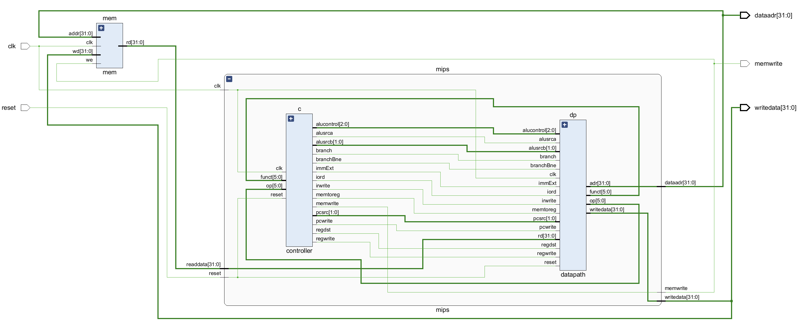
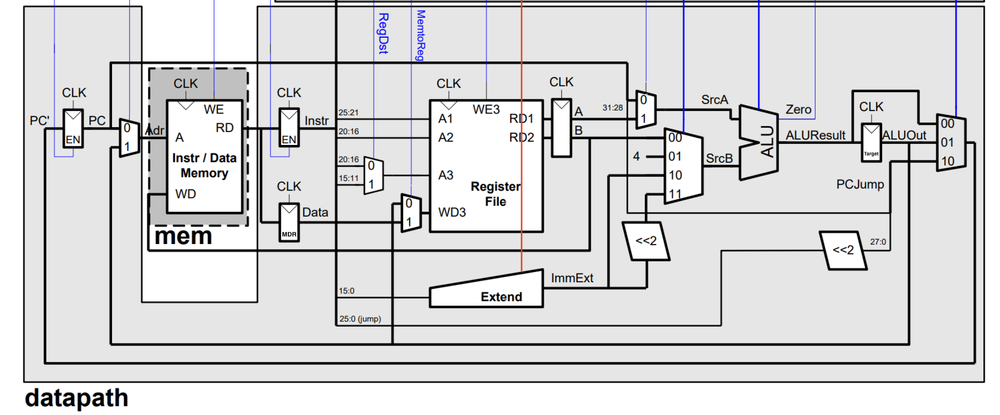
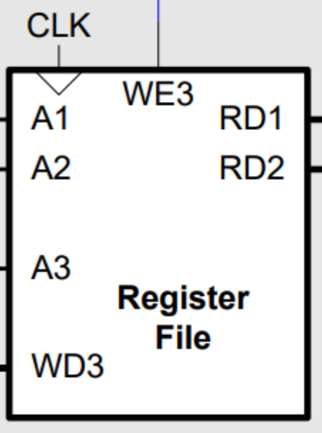
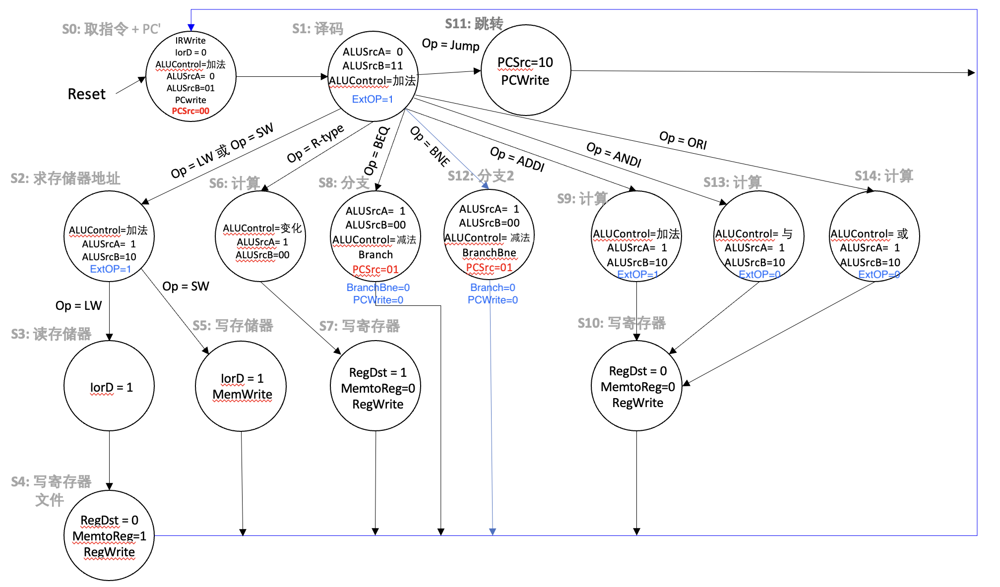
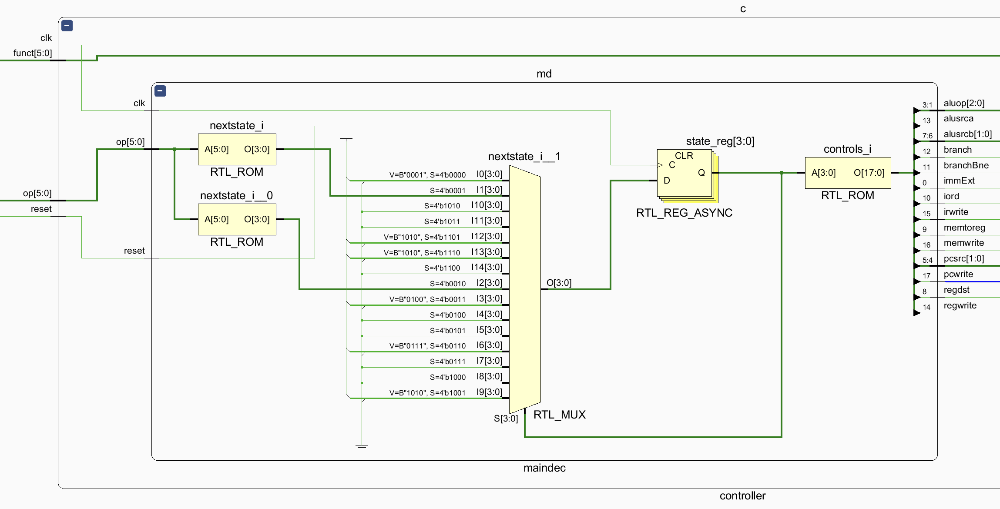
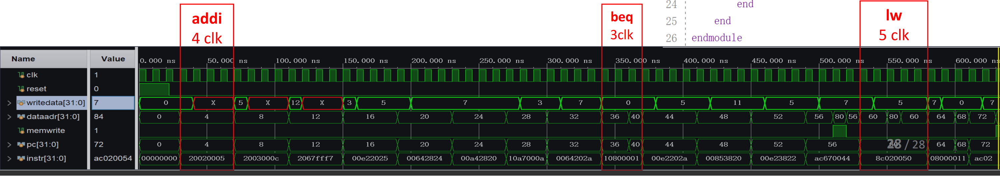
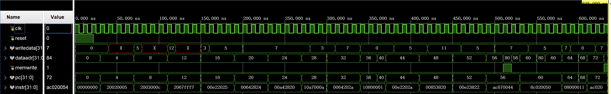
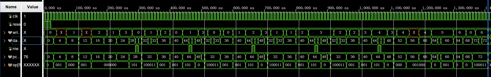

# A Multicycle MIPS Processor

> This is a project of Computer Architecture, 2023 Spring, Fudan Univ.


## 1 概述

本 MIPS 多周期处理器模拟器支持以下 MIPS 指令。支持通过 simulation 测试处理器行为，已在 Vivado 2019.2 中完成测试。

`lw, sw, add, sub, and, or, slt, beq, addi, subi, j, bne, andi, ori`

本 README 对原理未作过多解释，请参考「`./references/textbook.pdf`」及「`./references/slide.pptx`」


## 2 设计

### 2.1 整体结构

本实验按照「`./references/slide.pptx`」进行设计，并结合部分「`./references/textbook.pdf`」中的设计。部件与控制信号与后者中的设计有以下几点不同：

1. **加入了寄存器`A`、`B`、`MDR`。** 在多周期处理器中，这三个寄存器加入与否都可行。若加入，在各自的第n个周期时数据源传来数据并在本周期内将数据稳定，同时打开`A`/`B`/`MDR`写信号，则这三个寄存器在各自的n+1个周期的开始被写入并被`MUX`选通参与`ALU`计算（`MDR`不参与），在各自的第n+2个周期被写入下一个寄存器。若不加入，在各自的第n个周期数据源同样传来数据并在本周期内将数据稳定，在各自的第n+1个周期被`MUX`选通并参与`ALU`计算（`MDR`不参与），在各自的第n+2个周期被写入下一个寄存器。综上，是一样的。*但是，在之后的流水线处理器中就是必须要加入的了。*
2. **去除IRFetch/ID周期中暂存投机计算结果的寄存器Target的写使能`BrWr`；`ALU`计算结果回写的数据源（`ALUOut`）更改为来自`Target`寄存器之后，而不是直接来自`ALU`输出端。**
   - 对于`BrWr`：实际上，加入与否都可行，本次实验按照「`./references/slide.pptx`」中对于本部分的设计，去除了`BrWr`信号，每次ALU计算结果都会被写入`Target`，但只需要在指令并非跳转指令时不选通此路径即可（即，`PCSrc`不为01）。
   - 对于后者：这带来的好处是，进行R-Type和I指令运算后，第四周期不需要保持第三周期中的所有控制信号了，第三周期也无需置`RegDst`，因为运算结果也会保存在`Target`中，直接取出即可。能够减少状态数。（此点将在[控制单元](###2.1.3 控制单元)中详细描述）。
3. **分支使能新增针对`bne`指令的控制信号。** 在下方整体结构中，`PCEn`处新增一条 $BranchBne\space\cdot\space \overline{zero}$ 通路。在`bne`指令的第三周期（BneExec周期）时`BranchBne = 1`。

整体结构如下，黑色部分为[数据通路](###2.1.2 数据通路)，蓝色部分为[控制单元](###2.1.3 控制单元)。详细设计将在后续介绍。下图中，红色部分为相较于「`./references/slide.pptx`」的更改内容，解释如下：

1. **新增`ExtOP`控制信号。** 1时符号位拓展，0时零拓展。
2. **新增`BranchBne`控制信号通路。** 如上所述，`PCEn`处新增一条 $BranchBne\space\cdot\space \overline{zero}$ 通路。在`bne`指令的第三周期（BneExec周期）时`BranchBne = 1`。



整体RTL图如下，与上图等价（其中`immExt`为上图`ExtOP`）：



**顶层模块`Top`：** 包含存储器`mem`、处理器核心`mips`。输入为时钟信号、重置信号。

```systemverilog
`timescale 1ns / 1ps
module top(input logic clk,reset,
           output logic [31:0] writedata,dataadr,
           output logic memwrite);
           
    logic [31:0] readdata;
    
    mips mips(clk,reset,dataadr,writedata,memwrite,readdata);
    mem  mem(clk,memwrite,dataadr,writedata,readdata);        
    
endmodule
```

**处理器核心`mips`：** 包含控制模块`controller`、数据通路`datapath`，实现了对指令的读取翻译、数据传输、内存控制等功能。

```systemverilog
module mips(input logic clk,
            input logic reset,
            output logic [31:0] dataadr,
            output logic [31:0] writedata,
            output logic memwrite,
            input logic [31:0] readdata);
    
    logic [5:0] op,funct;
    logic zero,pcwrite,irwrite,regwrite,alusrca;
    logic branch,branchBne,iord,memtoreg,regdst;
    logic [1:0] alusrcb,pcsrc;
    logic [2:0] alucontrol;
    logic extOp;
    
    controller c(clk,reset,op,funct,pcwrite,memwrite,irwrite,
                regwrite,alusrca,branch,branchBne,iord,memtoreg,regdst,
                alusrcb,pcsrc,alucontrol,extOp);
    
    datapath dp(clk, reset, memtoreg, regdst, iord, alusrca,
            pcwrite, branch,branchBne,irwrite, regwrite,alucontrol,
            alusrcb, pcsrc,readdata,extOp,op, funct,dataadr, writedata);        
          
endmodule
```

**存储器`mem`：** 本次实验中，将指令存储器`imem`和数据存储器`dmem`合并，如下。

```systemverilog
`timescale 1ns / 1ps
module mem(input logic clk,
           input logic we,
           input logic [31:0] addr,
           input logic [31:0] wd,
           output logic [31:0] rd);
    logic [31:0]RAM[63:0];
    //imem
    initial
        $readmemh("memfile.dat",RAM); 
    assign rd=RAM[addr[31:2]];
    //dmem
    always_ff@(posedge clk)
        if(we)
            RAM[addr[31:2]]<=wd;
endmodule
```


#### 2.1.2 数据通路

实现了下图中所有部分。数据通路`datapath`模块在各元件之间传递数据，许多部件在「单周期处理器」中已经实现。为了复用代码，本实验中将有符号拓展、无符号拓展合分别实现为两个部件，并用一`MUX`进行选择，选通信号为`ExtOP`，下图中`Extend`部件为上述几个部件封装后的。



上述数据通路配合控制单元够实现所有给出的指令。下表描述了所有部件的名称与其对应systemverilog文件的对应关系，以及「单周期处理器」中是否已经实现。接下来只对未实现的部分进行介绍。

| 部件名 & 上图中该部件的名称(若有) | 对应的systemverilog文件       | 是否已在「单周期处理器」中实现 |
| --------------------------------- | ----------------------------- | ------------------------------ |
| datareg (MDR)                     | flopr.sv                      | Y                              |
| muxa3 (选择A3)                    | mux2.sv                       | Y                              |
| muxwd3 (选择WD3)                  | mux2.sv                       | Y                              |
| pcreg (上图最左侧暂存新PC的)      | flopenr.sv (带使能端的寄存器) | N                              |
| muxaddr (选择Adr)                 | mux2.sv                       | Y                              |
| rf (Register File)                | regfile.sv (寄存器文件)       | N (相比于「单周期」，有改动)   |
| fa (RD1右侧所连寄存器的A部分)     | flopr.sv                      | Y                              |
| fb (RD2右侧所连寄存器的B部分)     | flopr.sv                      | Y                              |
| instrreg (指令寄存器IR)           | flopenr.sv (带使能端的寄存器) | N                              |
| se (Sign Extend)                  | signext.sv                    | Y                              |
| ze (Zero Extend)                  | zenext.sv                     | Y                              |
| immsh (<<2)                       | sl2.sv                        | Y                              |
| muximmsimm (选有无符号拓展)       | mux2.sv                       | Y                              |
| muxsrca (选择ALU的SrcA)           | mux2.sv                       | Y                              |
| mux4srcb (选择ALU的SrcB)          | mux4.sv (4数据源的MUX)        | N                              |
| muxpc (上图最右侧的MUX)           | mux4.sv (4数据源的MUX)        | N                              |
| pcjump (负责J指令的<<2)           | sl2.sv                        | Y                              |
| alu (ALU)                         | alu.sv                        | N (相比于「单周期」，有改动)   |
| falu (Target)                     | flopr.sv                      | Y                              |

**带使能端的寄存器`flopenr.sv`：** 相比于`flopr.sv`，增加使能信号`en`。

```systemverilog
module flopenr #(parameter WIDTH = 8)
                (input logic clk,reset,
                 input logic en,
                 input logic [WIDTH-1:0] d,
                 output logic [WIDTH-1:0] q);
    always_ff@(posedge clk,posedge reset)
        if(reset) q<=0;
        else if(en) q<=d;
endmodule
```

**4数据源的MUX`mux4.sv`：**

```systemverilog
`timescale 1ns / 1ps
module mux4#(parameter WIDTH=8)
            (input logic[WIDTH-1:0]d0,d1,d2,d3,
             input logic [1:0] s,
             output logic [WIDTH-1:0]y);
    always_comb
        case(s)
            2'b00:  y=d0;
            2'b01:  y=d1;
            2'b10:  y=d2;
            2'b11:  y=d3;
        endcase
endmodule
```

**寄存器文件`regfile.sv`：** 其中，`we3`为寄存器写使能端口（将接收控制单元发出的`RegWrite`信号），`A1`, `A2`为源寄存器端口，`A2`为目的寄存器端口，`WD3`为写入数据端口，`RD1`, `RD2`为源寄存器输出端口。代码和示意图如下。



```systemverilog
`timescale 1ns / 1ps
module regfile(input  logic         clk,
               input  logic         we3,
               input  logic [4:0]   ra1, ra2, wa3,
               input  logic [31:0]  wd3,
               output logic [31:0]  rd1, rd2
    );
    logic [31:0]rf[31:0];  
    always_ff @(posedge clk)
        if(we3) rf[wa3] <= wd3;
     
    assign rd1 = (ra1 != 0) ? rf[ra1]:0;
    assign rd2 = (ra2 != 0) ? rf[ra2]:0;
endmodule
```

**ALU`alu.sv`：** `alucontrol`为控制端口，传入的信号将决定执行的操作，另外，输出结果在`out`，运算结果为0时`zero`被置1。

```systemverilog
`timescale 1ns / 1ps
module alu(input logic [31:0]a,b,
           input logic [2:0]alucontrol,
           output logic [31:0]out,
           output logic zero);
    always_comb
        case(alucontrol)
            3'b000:out=a&b;
            3'b001:out=a|b;
            3'b010:out=a+b;
            3'b011:out=(a<b)?1:0;
            3'b100:out=a&(~b);//-b
            3'b101:out=a|(~b);//-b
            3'b110:out=a-b;
            3'b111:out=(a<b)?1:0;
            default:out={32{1'b0}};
        endcase
    assign zero=(out!=0)?0:1;
endmodule
```


#### 2.1.3 控制单元

控制单元的FSM图如下。包含了本次实验的所有指令（`R-type`, `lw`, `sw`, `beq`, `addi`, `andi`, `bne`, `ori`, `j`）。为避免错误，在任一状态下的可取任意值`x`的控制信号（下图中每个状态中未标出的信号）默认全部取0，但`ExtOP`默认1。

详细设计如下。下图中，蓝色部分为相较于「`./references/slide.pptx`」的更改内容，几个值得注意的点：

1. **R-Type的第三周期（RExec周期）中无需使`RegDst = 1`。**

   - 此处和「`./references/textbook.pdf`」上的描述有区别，因为在本实验的设计中，去除了对`Target`的写使能信号`BrWr`，任何`ALU`计算结果都会被暂存到`Target`中，因此在第四周期中可从中直接取出。
   - 而「`./references/textbook.pdf`」`中，R-Type第三周期并未将`ALU`结果暂存于任何地方，因此必须置`RegDest = 1`，以免在R-Type第四周期（RFinish周期）开始时目的寄存器信号未稳定引起竞争。

2. **R-Type的第四周期（RFinish周期）中不需要保持RExec周期中信号不变。**

   - 理由同上。
   - 而「`./references/textbook.pdf`」中，R-Type第三周期并未将`ALU`结果暂存于任何地方，因此必须继续保持RExec周期中各个控制信号不变，以免RFinish周期开始时数据源过早撤去造成信号建立时间不足，导致写入失败。

3. **部分I指令（`andi`, `ori`, `addi`）的第三、第四周期的情况同上。**

   理由同1、2。

4. **`lw`/`sw`第三周期无需使`IorD = 1`，第四周期无需保持四三周期中信号不变。特别地，`lw`第四周期无需使`MemToReg = 1`, `RegDst = 0`，第五周期无需保持第三、第四周期信号不变。** 

   理由同1、2。

   特别地，`lw`第四周期无需使`MemToReg = 1`, `RegDst = 0`的原因是加入了`MDR`寄存器，与`Target`一样能起到暂存数据的作用，因此同1、2。

5. **部分状态中需要增加`ExtOP`信号。**

   如下图，如前所述，1时符号位拓展，0时零拓展。
   
   

**控制单元`control`：** 包含`Main Controller`和`ALU Decoder`。前者对指令进行译码，实现了除`ALUControl`信号以外的FSM。后者用于产生`ALUControl`信号，控制`ALU`的运算操作，详细见后。

```systemverilog
module controller(input  logic      clk,reset,
                  input  logic[5:0] op, funct,
                  output logic      pcwrite,
                  output logic      memwrite, 
                  output logic      irwrite,
                  output logic      regwrite,
                  output logic      alusrca,
                  output logic      branch,branchBne,iord,memtoreg,
                  output logic      regdst,
                  output logic[1:0] alusrcb,pcsrc,
                  output logic[2:0] alucontrol,
                  output logic      immExt  // ExtOP
                  );
    
    logic[2:0] aluop;
    
    maindec md(clk,reset,op,pcwrite,memwrite,irwrite,regwrite,
          alusrca,branch,branchBne,iord,memtoreg,regdst,alusrcb,pcsrc,aluop,immExt);
    aludec  ad(funct, aluop, alucontrol);
    
endmodule
```

**ALU Decoder`aludec.sv`：** 用于产生`ALUControl`信号，控制`ALU`的运算操作。

- 指令不为R-Type时，根据上述FSM图可知本次实验中只需要`ALUControl = Add`、`ALUControl = Sub`、`ALUControl = And`、`ALUControl = Ori`。
- 指令为R-Type时，根据R-Type指令的`Funct`部分决定`ALUControl`信号。

```systemverilog
`timescale 1ns / 1ps

module aludec(input  logic [5:0] funct,
              input  logic [2:0] aluop,
              output logic [2:0] alucontrol
    );
    always_comb
        case(aluop)
            3'b000: alucontrol <= 3'b010;   // add(for lw/sw/addi)
            3'b001: alucontrol <= 3'b110;   // sub(for beq & bne)
            3'b010: alucontrol <= 3'b000;   // andi
            3'b011: alucontrol <= 3'b001;   // ori
            default: case(funct)             //R-type instructions
                6'b100000: alucontrol <= 3'b010; //add
                6'b100010: alucontrol <= 3'b110; //sub
                6'b100100: alucontrol <= 3'b000; //and
                6'b100101: alucontrol <= 3'b001; //or
                6'b101010: alucontrol <= 3'b111; //slt
                default:   alucontrol <= 3'bxxx;
                endcase
        endcase
endmodule
```

**Main Decoder`maindec.sv`：** 对指令进行译码，实现了除`ALUControl`信号以外的FSM。根据前述FSM可知是Moore状态机，本实验中采用硬连线设计来实现任一状态下控制信号的指定，以下将分几段介绍：

- **定义FSM图中的15个状态S0~S14：**

  ```systemverilog
  // States
  localparam FETCH    =4'b0000;   // IFetch
  localparam DECODE   =4'b0001;   // RFetch/ID
  localparam MEMADR   =4'b0010;   // LW/SW MemAdr
  localparam MEMRD    =4'b0011;   // LW MemFetch
  localparam MEMWB    =4'b0100;   // LW Finish
  localparam MEMWR    =4'b0101;   // SW Finish
  localparam RTYPEEX  =4'b0110;   // R-Type Exec
  localparam RTYPEWB  =4'b0111;   // R-Type Finish
  localparam BEQEX    =4'b1000;   // Beq Exec (Finish)
  localparam ADDIEX   =4'b1001;   // Addi Exec
  localparam IWB   		=4'b1010;   // I-Type Finish
  localparam JEX      =4'b1011;   // Jump Exec(Finish)
  localparam BNEEX    =4'b1100;   // Bne Exec(Finish)
  localparam ANDIEX   =4'b1101;   // Andi Exec
  localparam ORIEX    =4'b1110;   // Ori Exec
  ```

- **指定各需要实现的指令的OP Code：**

  ```systemverilog
  // OP Code
  localparam LW       =6'b100011;
  localparam SW       =6'b101011;
  localparam RTYPE    =6'b000000;
  localparam BEQ      =6'b000100;
  localparam ADDI     =6'b001000;
  localparam J        =6'b000010;
  localparam ANDI     =6'b001100;
  localparam ORI      =6'b001101;
  localparam BNE      =6'b000101;
  ```

- **Moore状态机状态转换（时序逻辑）：** 每周期进行一次状态转换，上升沿触发。

  ```systemverilog
  logic [3:0] state,nextstate;
  logic [16:0] controls;
  
  //state register
  always_ff@(posedge clk or posedge reset)
      if(reset) state <= FETCH;
      else      state <= nextstate;
  ```

- **Moore状态机次态指定（组合逻辑）：** 描述了前述FSM图。

  ```systemverilog
  //next state logic
  always_comb
      case(state)
          FETCH:  nextstate = DECODE;
          DECODE: case(op)
                  LW:       nextstate = MEMADR;
                  SW:       nextstate = MEMADR;
                  RTYPE:    nextstate = RTYPEEX;
                  BEQ:      nextstate = BEQEX;
                  ADDI:     nextstate = ADDIEX;
                  J:        nextstate = JEX;
                  ANDI:     nextstate = ANDIEX;
                  ORI:      nextstate = ORIEX;
                  BNE:      nextstate = BNEEX;
                  default:  nextstate = 4'bx; // never happen
          endcase
          MEMADR: case(op)                    // LW/SW MemAdr
                  LW:       nextstate = MEMRD;// LW MemFetch
                  SW:       nextstate = MEMWR;// SW Finish
                  default:  nextstate = 4'bx;
          endcase
          MEMRD:  nextstate = MEMWB;          // -> LW Finish
          MEMWB:  nextstate = FETCH;
          MEMWR:  nextstate = FETCH;
          RTYPEEX:nextstate = RTYPEWB;
          RTYPEWB:nextstate = FETCH;
          BEQEX:  nextstate = FETCH;
          ADDIEX: nextstate = IWB;
          IWB:    nextstate = FETCH;
          JEX:    nextstate = FETCH;
          ANDIEX: nextstate = IWB;
          ORIEX:  nextstate = IWB;
          BNEEX:  nextstate = FETCH;
          default:nextstate = 4'bx;//never happen
      endcase
  ```

- **采用硬连线设计实现的控制信号发生器：** 指定各状态下控制信号的情况，根据FSM图填写。为避免错误，在任一状态下的可取任意值`x`的控制信号（下图中每个状态中未标出的信号）默认全部取0，但`ExtOP`默认1。

  ```systemverilog
  assign {pcwrite,memwrite,irwrite,regwrite,
          alusrca,branch,branchBne,iord,memtoreg,regdst,
          alusrcb,pcsrc,aluop,immExt} = controls;
  
  always_comb
      case(state)
          FETCH:  controls = 18'b1010_000000_01_00_000_1;	// aluop: Add
          DECODE: controls = 18'b0000_000000_11_00_000_1;
          MEMADR: controls = 18'b0000_100000_10_00_000_1;
          MEMRD:  controls = 18'b0000_000100_00_00_000_1;
          MEMWB:  controls = 18'b0001_000010_00_00_000_1;
          MEMWR:  controls = 18'b0100_000100_00_00_000_1;
          RTYPEEX:controls = 18'b0000_100000_00_00_100_1; // aluop: default(R-Type)
          RTYPEWB:controls = 18'b0001_000001_00_00_000_1;
          BEQEX:  controls = 18'b0000_110000_00_01_001_1; // aluop: Sub
          ADDIEX: controls = 18'b0000_100000_10_00_000_1;
          IWB:    controls = 18'b0001_000000_00_00_000_1;
          JEX:    controls = 18'b1000_000000_00_10_000_1;
          BNEEX:  controls = 18'b0000_101000_00_01_001_1; // aluop: Sub 
          ANDIEX: controls = 18'b0000_100000_10_00_010_0; // aluop: And
          ORIEX:  controls = 18'b0000_100000_10_00_011_0; // aluop: Or
          default:controls = 18'bxxxx_xxxxxx_xx_xx_xxx_x; //neverhappen
      endcase 
  ```

综上，Main Decoder的RTL图如下。包含现态`state`和次态`nextstate`的状态转换逻辑，右侧是18位控制信号输出（共14个信号）。




### 2.2 仿真

本部分对基本要求的指令进行仿真。包含`lw`, `sw`, `add`, `sub`, `and`, `or`, `slt`, `beq`, `addi`, `j`。

代码如下，与「`./references/slide.pptx`」中的一致。

```assembly
main:
  addi $2, $0, 5
  addi $3, $0, 12 
  addi $7, $3, -9 
  or $4, $7, $2 
  and $5, $3, $4 
  add $5, $5, $4 
  beq $5, $7, end
  slt $4, $3, $4 
  beq $4, $0, around
  addi $5, $0, 0 
around:
	slt $4, $7, $2 
  add $7, $4, $5 
  sub $7, $7, $2 
  sw $7, 68($3) 
  lw $2, 80($0) 
  j end
  addi $2, $0, 1 
end:
	sw $2, 84($0)
```

对应HEX代码如下。

```
20020005
2003000C
2067FFF7
00E22025
00642824
00A42820
10A7000A
0064202A
10800001
20050000
00E2202A
00853820
00E23822
AC670044
8C020050
08000011
20020001
AC020054
```

将代码装入存储器`mem`，如下。

```systemverilog
`timescale 1ns / 1ps
module mem(input logic clk,
           input logic we,
           input logic [31:0] addr,
           input logic [31:0] wd,
           output logic [31:0] rd);
    logic [31:0]RAM[63:0];
  
    //imem
    initial
        $readmemh("memfile.dat",RAM); 
    assign rd=RAM[addr[31:2]];
  
    //dmem
    always_ff@(posedge clk)
        if(we)
            RAM[addr[31:2]]<=wd;
endmodule
```

测试程序`testbench1.sv`如下：

```systemverilog
module textbench1();
    logic clk;
    logic reset;

    logic[31:0] writedata , dataadr;
    logic       memwrite;

    //instantiate device to be tested
    top dut(clk, reset, writedata, dataadr, memwrite);

    //initialize test
    initial
        begin
            reset <= 1; #22; reset <= 0;
        end

    //generate clock to sequence tests
    always
        begin
            clk <= 1; #5; clk <= 0; #5;
        end

    always@(negedge clk)
            begin
                if(memwrite) begin
                    if(dataadr===84&writedata===7)begin
                        $display("Simulation succeeded");
                        $stop;
                    end else if(dataadr!==80) begin
                        $display("Simulation failed");
                        $stop;
                    end
                end
             end
 endmodule
```

**仿真结果**

- 「`./references/slide.pptx`」中的结果样例：

  

- 本实验中得到的结果：

  与上述对比可知，结果正确，能够明显看到`pc`在多个周期中维持不变，随后进入下一`pc`，与多周期处理器效果相符。并得到“Simulation Succeeded”输出。

  

  
  
  

### 2.3 验证

本部分对全部要求的指令进行仿真验证。代码如下，覆盖了所有需要实现的指令。全程对存储器的读写都只针对`Mem[0x80]`，当且仅当运行到最后一步时会对其写入6，因此可以以此判断是否正确运行。

```assembly
main:
    addi $s1, $0, 0x1       # 1 -> $s1
    sub  $s0, $s1, $s1      # 0 -> $s0
    ori  $s2, $s0, 0x2      # 2 -> $s2
    or   $s3, $s1, $s2      # 3 -> $s3
    and  $s4, $s2, $s1      # 0 -> $s4
    slt  $s0, $s2, $s3      # 1 -> $s0
    sw   $s4, 0x80($0)      # 0 -> Mem[0x80]
chkswitch:
    lw   $s1, 0x80($0)      # 0 -> $s1, 1 -> $s1, 2 -> $s1, 3 -> $s1
    andi $s2, $s1, 0x3      # 0 -> $s2, 1 -> $s2, 2 -> $s2, 3 -> $s2
    addi $s4, $s4, 0x1      # 1 -> $s4, 2 -> $s4, 3 -> $s4, 4 -> $s4
    sw   $s4, 0x80($0)      # last: 4 -> Mem[0x80]
    bne  $s2, $s3, chkswitch
    add  $s5, $s0, $s4      # 1 + 4 -> $s5
    addi $s6, $0, 0x4       # 4 -> $s6
chkbeq:
    addi $s6, $s6, 0x1      # 5 -> $s6, 6 -> $s6
    beq  $s5, $s6, chkLED   # do      , ignore
    j    end
end:
    lw   $s6, 0x80($0)      # 6 -> $s0
```

对应HEX代码如下。

```
20110001
02318022
36120002
02329825
0251a024
0253802a
ac140080
8c110080
32320003
22940001
ac140080
1653fffb
0214a820
20160004
22d60001
12B6FFFE
08000011
8c160080
```

将代码装入存储器`mem`，略。测试程序`testbench.sv`如下，若正确运行，则当运行到最后一步时将会“Simulation Succeeded”。

```systemverilog
module textbench();
    logic clk;
    logic reset;

    logic[31:0] writedata , dataadr;
    logic       memwrite;

//instantiate device to be tested
    top dut(clk, reset, writedata, dataadr, memwrite);

//initialize test
    initial
        begin
            reset <= 1; #22; reset <= 0;
        end
   
//generate clock to sequence tests
    always
        begin
            clk <= 1; #5; clk <= 0; #5;
        end
    
    always@(negedge clk)
            begin
                if(memwrite) begin
                    if(dataadr===128&writedata===6)begin
                        $display("Simulation succeeded");
                        $stop;
                    end else if(dataadr!==128) begin
                        $display("Simulation failed");
                        $stop;
                    end
                end
            end
    endmodule
```

**仿真结果**

如下，较为狭窄，但经分析是正确的。数据从上到下分别是：`clk`, `reset`, `writedata[31:0]`, `dataadr[31:0]`, `memwrite`, `pc[31:0]`, `op[5:0]`。


